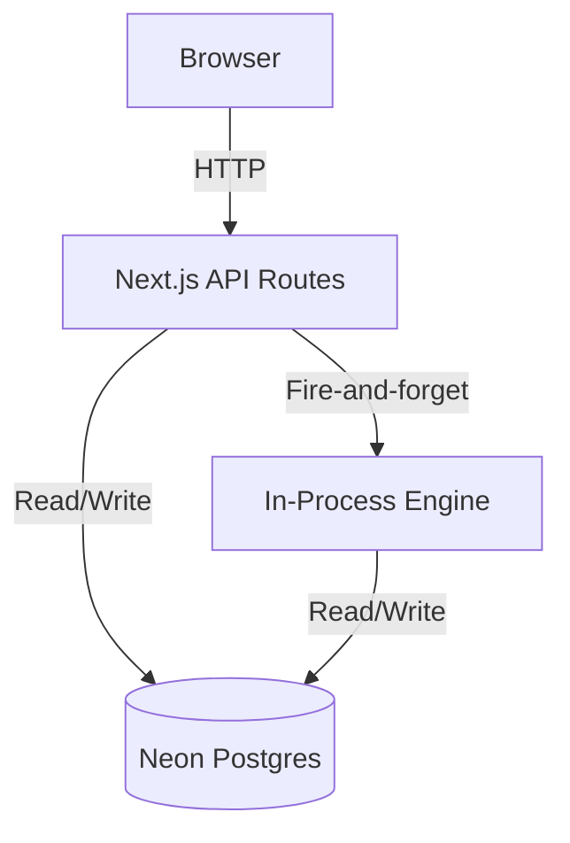

# Architecture: Phase 1 (Monolith Baseline)

This phase focuses on establishing the domain model and a working baseline execution engine.

## Component Diagram

```mermaid
graph TD
    Browser[Browser] -->|HTTP| API[Next.js API Routes]
    API -->|Read/Write| DB[(Neon Postgres)]
    API -->|Fire-and-forget| Engine[In-Process Engine]
    Engine -->|Read/Write| DB
```
